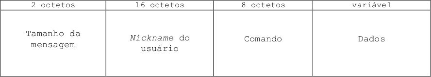

# Chat-em-Python

## Executáveis:

Execute o cliente e o servidor pelos [clienteEXE](./clienteEXE) e [servidorEXE](./servidorEXE) de dentro do diretório raiz
```console
$ ./<cliente/servidor>EXE
```
Ou ative o ambinete virual por conta própria e execute os códigos em python [chatCliente.py](./chatCliente.py) e [chatServidor.py](./chatServidor.py)
```console
$ source /chat/bin/activate
$ python3 chat<Cliente/Servidor>.py
```

## Implementação de cliente:

Para ver o necessário para montar seu próprio cliente, recomendo dar uma olhada no [chatCliente.py](./chatCliente.py) e no [protocolo.py](./protocolo.py)

## Estrutura do protocolo:

Toda mensagem (Dados) trocada entre o servidor e o cliente deve ser codificada para **utf-8** e seguida de um cabeçalho de **tamanho fixo de 26 bytes**, resultando em quatro campos em série:
1. Tamanho da mensagem (incluindo o cabeçalho) em big-endian [2 bytes]
2. Apelido do usuário que está mandando a mensagem de até 16 caracteres, alinhado à esquerda (bytes mais significativos) e preenhido com espaço até completar os 16 caracteres [16 bytes]
3. Comando de 8 caracteres usado para controle e/ou para formatação da mensagem em tela [8 bytes]
4. Resto dos dados da mensagem [tamanho em bytes da própria mensagem]



